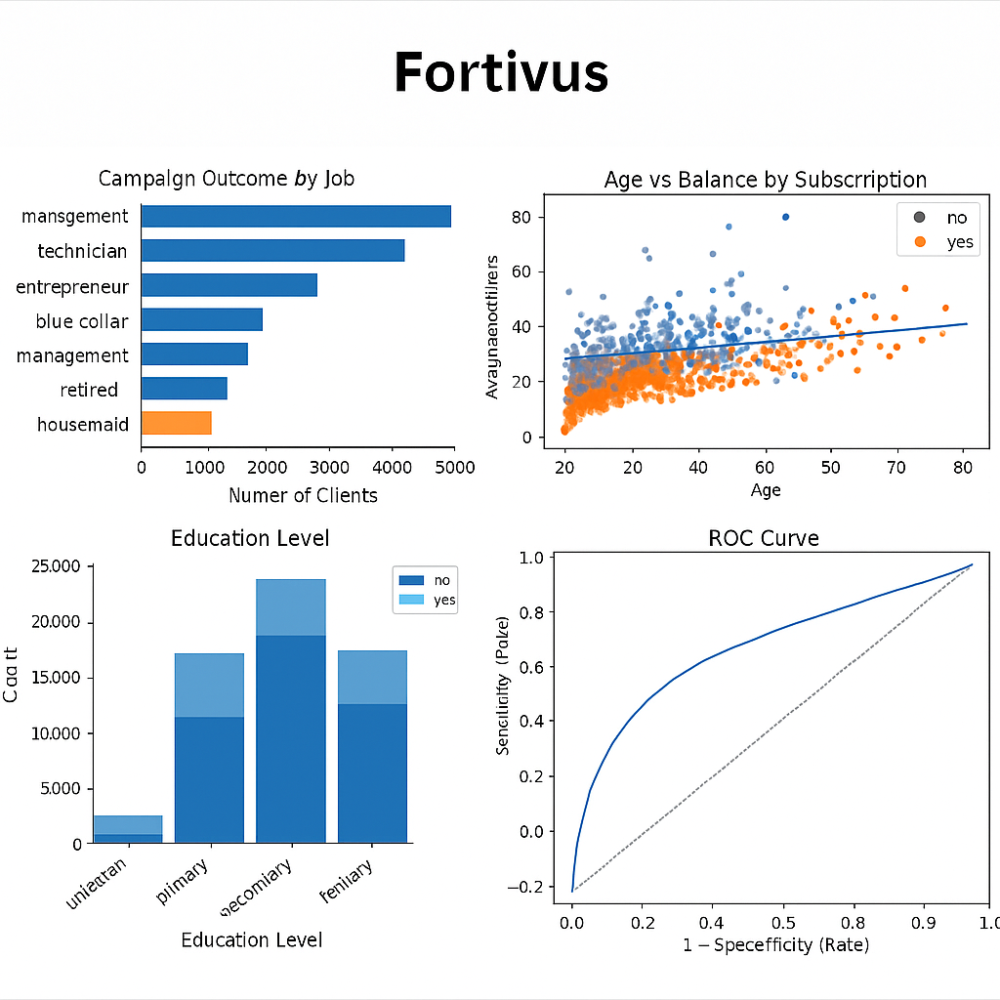

# 💼 Fortivus

[](https://www.python.org/)
[](https://pandas.pydata.org/)
[](https://numpy.org/)
[](https://scikit-learn.org/stable/modules/linear_model.html#logistic-regression)
[](#)

**Fortivus** is a futuristic approach to predicting whether a customer will subscribe to a bank’s term deposit plan, built using a **Logistic Regression** model on real marketing data.

---

## 🖼️ Preview


📄 [**View Full Project Report (PDF)**](ML_Project.pdf)

---

## 📌 Problem Statement
The dataset is related to **direct marketing campaigns** of a **Portuguese banking institution**.  
📞 The marketing campaigns were based on phone calls. Often, more than one contact with the same client was required in order to determine if the product (bank term deposit) would be **subscribed (‘yes’)** or **not subscribed (‘no’)**.

In this project, we build a **predictive model** to decide whether a campaign will be successful in getting a client to sign up for the term deposits.

---

## 📂 Dataset
The dataset is in CSV format and can be downloaded here:  
🔗 [**bank.csv**](https://cdn.upgrad.com/UpGrad/temp/e4993de3-06a6-4c7d-b12f-774ce36b592e/bank.csv)

---

## 📑 Data Description
**Bank client data**
- `age`: numeric  
- `job`: type of job (admin., blue-collar, entrepreneur, etc.)  
- `marital`: marital status (divorced, married, single, unknown)  
- `education`: education level (unknown, secondary, primary, tertiary)  
- `default`: has credit in default? (yes/no)  
- `balance`: average yearly balance in euros  
- `housing`: has housing loan? (yes/no)  
- `loan`: has personal loan? (yes/no)  

**Last contact details**
- `contact`: communication type (unknown, telephone, cellular)  
- `day`: last contact day of the month  
- `month`: last contact month of year (jan–dec)  
- `duration`: last contact duration in seconds  

**Other attributes**
- `campaign`: number of contacts performed during this campaign (includes last contact)  
- `pdays`: days since the client was last contacted from a previous campaign (-1 means not contacted before)  
- `previous`: number of contacts performed before this campaign  
- `poutcome`: outcome of the previous marketing campaign (failure, nonexistent, success)  

**Target variable**
- `y`: has the client subscribed a term deposit? (yes/no)

---

## 🎯 Objectives
✔️ Clean the data and drop irrelevant columns.  
✔️ Perform **EDA**: univariate and bivariate analysis.  
✔️ Derive new features, remove outliers, handle multicollinearity.  
✔️ Visualize distributions and correlations.  
✔️ Perform feature engineering to extract meaningful features.  
✔️ Build a **Logistic Regression** model.  
✔️ Evaluate the model using accuracy, precision, recall, and ROC‑AUC.

---

## 📈 Model Evaluation
- Predictions compared using `y_test` and `y_pred`.  
- **VIF** scores checked for multicollinearity.  
- **p‑values** of features reviewed before finalizing.  
- Evaluation metrics include:
  - ✅ Accuracy
  - ✅ Precision
  - ✅ Recall
  - ✅ ROC‑AUC

---

## 🛠 Tech Stack
- **Python 3.8+**
- **Pandas, NumPy** for data handling
- **Matplotlib, Seaborn** for visualization
- **Scikit‑Learn** for modeling
- **StatsModels** for statistical analysis

---

## 🚀 Installation
1. Clone this repository:
   ```bash
   git clone https://github.com/dj-ayush/Fortivus.git
   cd Fortivus
   ```
2. Install dependencies:
   ```bash
   pip install -r requirements.txt
   ```
3. Launch Jupyter Notebook:
   ```bash
   jupyter notebook BankMarketing.ipynb
   ```

---

## ▶️ Usage
- Open **BankMarketing.ipynb**.
- Run all cells step by step:
  - Data cleaning
  - EDA and feature engineering
  - Logistic Regression model training
  - Model evaluation
- Modify or extend as needed.

---

## 🤝 Contributing
Contributions are welcome!  
If you’d like to enhance **Fortivus**, fork the repository and submit a pull request.

---

💡 **Fortivus — futuristic insights for smarter banking decisions.**
